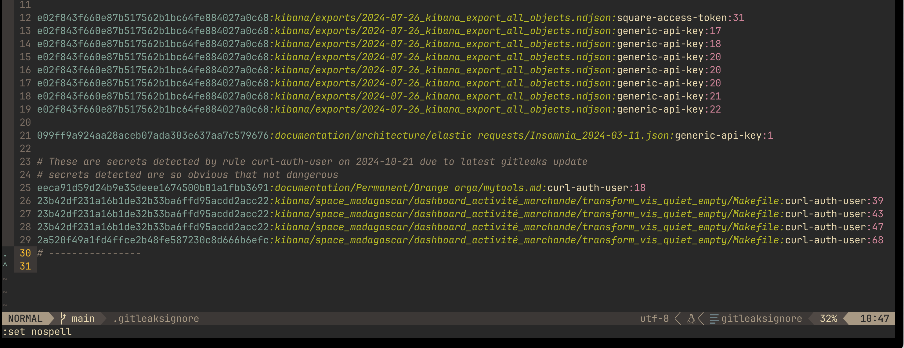

# gitleaksignore-syntax

vim syntax file for [Gitleaks](https://github.com/gitleaks/gitleaks) **".gitleaksignore"** files.

Will color items in line with different colors.
Will color [comments](https://github.com/gitleaks/gitleaks/issues/1425) also.

*Sample usage on neovim with gruvbox scheme*
